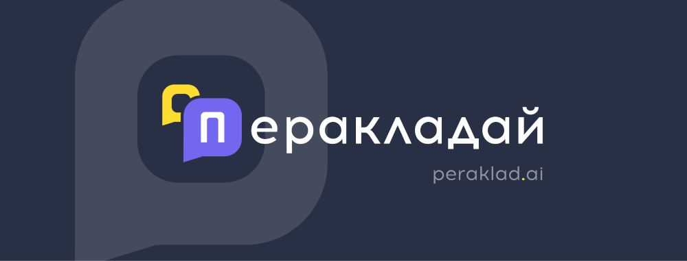

# Агульная інфармацыя

"Перакладай" — сэрвіс калектыўнага перакладу субтытраў і лакалізацыі праграмнага забяспечання.

Сэрвіс можа спатрэбіцца Вам, калі Вы:

1\) валодаеце замежнымі мовамі і хочаце дапамагчы перакласці кантэнт \(напрыклад, субтытры для фільмаў\), альбо зрабіць беларускамоўную версію для пэўнай праграмы, гульні, мабільнага дадатка альбо сайта.

2\) хочаце зрабіць беларускія субтытры для фільма альбо беларускую версію для пэўнай праграмы, але Вам патрэбная дапамога перакладчыкаў. 

