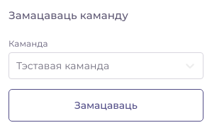

# Кіраванне праектам

## Стварэнне праекта

Для таго, каб стварыць праект, неабходна выбраць у меню катэгорыю праекта — _субтытры_ альбо _лакалізацыя_ — і на старонцы спісу праектаў націснуць на кнопку "Стварыць". **На цяперашні момант карыстальнік абмежаваны трыма праектамі для кожнай катэгорыі \(састаўныя праекты не ўлічваюцца\).** Калі карыстальнік ужо стварыў столькі праектаў, кнопка зробіцца неактыўнай.

### Субтытры

Форма стварэння праекта па перакладзе субтытраў залежыць ад выбранага IMDB тыпу — _фільм_, _серыял_ альбо _серыя_.

#### Фільм

Абавязковымі палямі з'яўляюцца "Назва ў перакладзе" \(па-беларуску\), "Назва ў арыгінале" \(на мове арыгіналу\) і год выхаду фільма. Хоць астатнія палі не з'яўляюцца абавязковымі, некаторыя з іх могуць несці важную інфармацыю для працы сэрвісу. Напрыклад, пазначэнне IMDB ідэнтыфікатара фільма можа спрасціць аўтаматычны пошук у сеціве субтытраў і звестак пра фільм. Калі IMDB ідэнтыфікатар не ўведзены, то можна пазначыць карэктныя значэнні ў назве на мове арыгіналу і ў годзе выхаду, каб пошук спрацаваў.

Пасля ўвядзення значэнняў адбудзецца аўтаматычнага спроба знайсці астатнія звесткі пра фільм у сеціве.

У выпадку паспяховага пошуку можна будзе перанесці гэтыя звесткі ў Вашу форму, з магчымасцю рэдагавання плаката фільма.

#### Серыял

Калі IMDB тып з'яўляецца серыялам, то адбудзецца аўтаматычная замена на іншую форму.

Для таго, каб перакладаць серыял, неабходна ствараць падпраекты серый пад агульным праектам. Калі ў серыяле быў пазначаны IMDB ідэнтыфікатар, сэрвіс паспрабуе знайсці спіс серый, якіх не мае бягучы праект.

Калі ў прапановах нічога няма, то можна скарыстацца формай справа, дзе ўручную неабходна будзе увесці нумар сеэона і серыі. Калі Вы знайшлі ў спісе прапанаваных серый тую, якую Вы жадаеце перакласці, неабходна націснуць на яе. Гэта накіруе Вас на форму стварэння серыі з аўтаматычным пошукам падрабязных звестак пра серыю.

#### Серыя

### Лакалізацыя

Стварэнне праекта па лакалізацыі праграм мае спрошчаны інтэрфейс. Абавязковым полем з'яляецца толькі "Назва праграмы". Тып праекта па лакалізацыі нагадвае IMDB тып праекта па перакладзе субтытраў: _асобны_, _састаўны_ і _падпраект_. Асобны праект не можа, з аднаго боку, ўваходзіць у састаўны праект, а з іншага — утрымліваць у сабе падпраекты. Састаўны праект не можа мець уласныя файлы для перакладу і мусць утрымліваць у сабе падпраекты. Падпраект мусць належыць да састаўнога праекта.

Поле "Правапіс перакладу" пакуль носіць толькі інфармацыйны сэнс для карыстальнікаў, але ў будучых рэлізах гэтая звестка спатрэбіцца для аўтаматычнай канвертацыі перакладзенага тэксту ад аднаго правапісу да другога \(пакуль такога функцыяналу няма\).

## Наладкі праекта

На старонцы наладак ёсць магчымасць выдаліць праект або змяніць тып доступу да яго.


Існуюць 3 варыянты доступу: _адкрыты_, _абмежаваны_ \(па змоўчанні\) і _закрыты_ праект. Ад выбранага варыянту залежыць, колькі магчымасцей будуць мець розныя групы карыстальнікаў, працуючы над праектам. Калі праект мае закрыты доступ, трапіць да яго змогуць толькі запрошаныя Вамі карыстальнікі альбо чальцы замацаванай на праект каманды. Калі праект адкрыты, кожны карыстальнік будзе мець магчымасць яго перакладаць. Калі праект абмежаваны, любы карыстальнік зможа праглядаць пераклады, але рабіць пераклады змогуць толькі запрошаныя карыстальнікі і чальцы замацаванай каманды. Чальцы каманды маюць шырэйшыя правы за тыя, якія маюць запрошаныя карыстальнікі. Чальцы каманды могуць самі запрашаць іншых карыстальнікаў, а таксама маюць больш магчымасцей у перакладзе тэксту.


## Запрашэнне карыстальнікаў

Каб запрашаць карыстальнікаў і замацоўваць каманды за праектам, неабходна перайсці на старонку "Удзельнікі".

Можна запрасіць любога зарэгістраванага карыстальніка праз форму ў правым блоку.

Каб пошук спрацаваў, неабходна ўвесці не менш за 3 першыя літары @username карыстальніка, якога Вы жадаеце запрасіць.

Пасля запрашэння карыстальнік будзе паказаны ў спісе тых, хто яшчэ не адказаў. Карыстальніку прыйдзе абвестка аб запрашэнні.

Перайсці на старонку пацверджання альбо адхілення запрашэння можна праз гэтую абвестку альбо на старонцы спісу праектаў той катэгорыі, да якой належыць праект \(група "Запрошаны"\).

Пасля пераходу запрошаным карыстальнікам на старонку праекта, ён зможа або пацвердзіць, або адхіліць запрашэнне.

Пасля пацверджання запрашэння, карыстальнік зменіць свой статус у праекце на "пацверджаны".

У любы момант можна скасаваць удзел у праекце як ад імя кіраўніка праекта, так і ад імя запрошанага карыстальніка.

## Замацаванне каманды

Замацоўваць на праект можна толькі тыя каманды, якія Вы стварылі самі. Таму спачатку трэба стварыць каманду і запрасіць туды карыстальнікаў.

Стварыць каманду можна, націснуўшы на кнопку "Стварыць" на старонцы спісу каманд. **На цяперашні момант карыстальнік абмежаваны стварэннем толькі двух каманд.** Пасля гэтага з'явіцца форма стварэння з адзіным абавязковым полем — "Назва каманды". Пасля стварэння каманды, яна з'явіцца ў спісе. Каб запрасіць у каманду карыстальнікаў, неабходна націснуць на назву каманды ў спісе альбо на спасылку "Інфармацыя".

Запрашэнне ў каманду працуе па той жа схеме, як і запрашэнне ў праект. Карыстальнік мусіць пацвердзіць запрашэнне, каб стаць чальцом каманды.

Пасля стварэння каманды Вы зможаце замацаваць яе на старонцы праекта.

Пасля замацавання каманды кожны яе чалец атрымае правы большыя, чым у запрошанага карыстальніка.

## Загрузка файлаў для перакладу

Загрузіць файлы для перакладу можна на старонцы "Файлы".

Загрузіць файл можна ўручную, калі Вы маеце яго. Калі праект належыць да катэгорыі субтытраў і ў ім пазначаны IMDB ідэнтыфікатар, можна скарыстацца аўтаматычным пошукам файлаў субтытраў у сеціве. Для гэтага трэба ўключыць пошук у правай панэлі. Пасля пэўнага часу сэрвіс пакажа спіс знойдзеных файлаў.

Пошук улічвае пазначаную мову крыніцы. Мова крыніцы можа адрознівацца ад мовы арыгіналу фільма. Яна можа быць любой у спісе.

![&#x41C;&#x43E;&#x432;&#x430; &#x43A;&#x440;&#x44B;&#x43D;&#x456;&#x446;&#x44B; &#x442;&#x44D;&#x43A;&#x441;&#x442;&#x443; &#x45E; &#x412;&#x430;&#x448;&#x44B;&#x43C; &#x444;&#x430;&#x439;&#x43B;&#x435; &#x430;&#x43B;&#x44C;&#x431;&#x43E; &#x45E; &#x442;&#x44B;&#x445; &#x444;&#x430;&#x439;&#x43B;&#x430;&#x445;, &#x44F;&#x43A;&#x456;&#x44F; &#x431;&#x443;&#x434;&#x437;&#x435; &#x448;&#x443;&#x43A;&#x430;&#x446;&#x44C; &#x441;&#x44D;&#x440;&#x432;&#x456;&#x441; &#x443; &#x441;&#x435;&#x446;&#x456;&#x432;&#x435;.](../.gitbook/assets/screenshot_13.png)

Калі пошук выдаў спіс файлаў, неабходна выбраць адзін з іх для яго загрузкі.


Можна загружаць файлы — як уручную, так і праз аўтаматычны пошук — толькі пэўных _фарматаў_. На цяперашні момант даступны наступныя фарматы:

**Для субтытраў:**

* SRT \(SubRip\)
* WebVTT \(Web Video Text Tracks\)
* SBV \(Youtube Captions\)
* SAMI \(Synchronized Accessible Media Interchange\)

**Для лакалізацыі:**

* JSON
* YAML
* XLIFF 1.2 / 2.0
* PO Gettext \(.po / .pot\)
* TMX \(Translation Memory Exchange\)
* RESX \(.NET Resource file\)
* Android XML
* iOS Strings
* PHP \(Laravel\)
* CSV \(Magento\)


Далей можна націскаць на кнопку "Загрузіць файл". **На цяперашні момант колькасць кавалкаў тэксту \(элементаў для перакладу\) у файле не павінна перавышаць 3000.**  Загрузка можа заняць да некалькіх дзясяткаў секунд. Калі ласка, пачакайце. Пасля загрузкі Вы будзеце перанакіраваны на старонку файла.

Калі праект належыць да катэгорыі "Лакалізацыя", даступна толькі ручная загрузка.

Каб загрузіць новы файл для праекта, неабходна вярнуцца да спісу файлаў. **На цяперашні момант праект абмежаваны двума файламі**.

Форма загрузкі новага файла паказваецца пад спісам, калі ліміт па колькасці файлаў яшчэ не дасягнуты.

