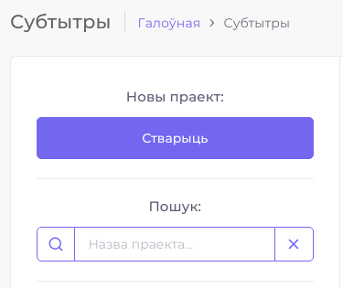

# Кіраванне праектам

## Стварэнне праекта

Для таго, каб стварыць праект, неабходна выбраць у меню катэгорыю праекта — _субтытры_ альбо _лакалізацыя_ — і на староны спісу праектаў націснуць на кнопку "Стварыць".

### Субтытры

Форма стварэння праекта па перакладзе субтытраў залежыць ад выбранага IMDB тыпу — _фільм_, _серыял_ альбо _серыя_.

#### Фільм

Абавязковымі палямі з'яўляюцца "Назва ў перакладзе" \(па-беларуску\), "Назва ў арыгінале" \(на мове арыгіналу\) і год выхаду фільма. Хоць астатнія палі не з'яўляюцца абавязковымі, некаторыя з іх могуць несці важную інфармацыю для працы сэрвісу. Напрыклад, пазначэнне IMDB ідэнтыфікатара фільма можа спрасціць аўтаматычны пошук звестак пра фільм і субтытраў у сеціве. Калі ён невядомы, то можна пазначыць правільныя значэнні ў назве на мове арыгіналу і ў годзе выхаду.

Пасля ўвядзення значэнняў адбудзецца аўтаматычнага спроба знайсці астатнія звесткі пра фільм у сеціве.

У выпадку паспяховага пошуку можна будзе перанесці гэтыя звесткі ў Вашу форму, з магчымасцю рэдагавання плаката фільма.

#### Серыял

Калі IMDB тып з'яўляецца серыялам, то адбудзецца аўтаматычная замена на іншую форму.

Для таго, каб перакладаць серыял, неабходна ствараць падпраекты серый пад агульным праектам. Калі ў серыяле быў пазначаны IMDB ідэнтыфікатар, сэрвіс паспрабуе знайсці спіс серый, якіх не мае бягучы праект.

Калі ў прапановах нічога няма, то можна скарыстацца формай справа, дзе ўручную неабходна будзе увесці нумар сеэона і серыі. Калі Вы знайшлі ў спісе прапанаваных серый тую, якую Вы жадаеце перакласці, неабходна націснуць на яе. Гэта накіруе Вас на форму стварэння серыі з аўтаматычным пошукам падрабязных звестак пра серыю.

#### Серыя

### Лакалізацыя

Стварэнне праекта па лакалізацыі праграм мае спрошчаны інтэрфейс. Абавязковым полем з'яляецца толькі "Назва праграмы". Тып праекта па лакалізацыі нагадвае IMDB тып праекта па перакладзе субтытраў: _асобны_, _састаўны_ і _падпраект_. Асобны праект не можа, з аднаго боку, ўваходзіць у састаўны праект, а з іншага — утрымліваць у сабе падпраекты. Састаўны праект не можа мець уласныя файлы для перакладу і мусць утрымліваць у сабе падпраекты. Падпраект мусць належыць да састаўнога праекта.

Поле "Правапіс перакладу" пакуль носіць толькі інфармацыйнае значэнне для карыстальнік, але ў будучых рэлізах гэтая звестка спатрэбіцца для аўтаматычнай канвертацыі перакладзенага тэксту ад аднаго правапісу да другога \(пакуль такога функцыяналу няма\).

## Наладкі праекта

На старонцы наладак ёсць магчымасць выдаліць праект або змяніць тып доступу да яго.


Існуюць 3 варыянты доступу: _адкрыты_, _абмежаваны_ \(па змоўчанні\) і _закрыты_ праект. Ад выбранага варыянту залежыць, колькі магчымасцей будуць мець розныя групы карыстальнікаў, працуючы над праектам. Калі праект мае закрыты доступ, трапіць да яго змогуць толькі запрошаныя Вамі карыстальнікі альбо чальцы замацаванай на праект каманды. Калі праект адкрыты, кожны карыстальнік будзе мець магчымасць яго перакладаць. Калі праект абмежаваны, любы карыстальнік зможа праглядаць пераклады, але рабіць пераклады змогуць толькі запрошаныя карыстальнікі і чальцы замацаванай каманды. Чальцы каманды маюць шырэйшыя правы за тыя, якія маюць запрошаныя карыстальнікі. Чальцы каманды могуць самі запрашаць іншых карыстальнікаў, а таксама маюць больш магчымасцей у перакладзе тэксту.


Каб запрашаць карыстальнікаў і замацоўваць каманды за праектам, неабходна перайсці на старонку "Удзельнікі".

