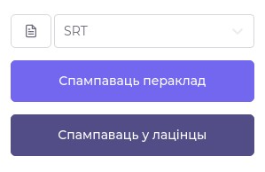

# Пераклад

Перакладаць можна альбо онлайн на сэрвісе, альбо аўтаномна. 

## Аўтаномная праца

Калі Вы можаце працаваць самастойна з файламі XLIFF, у Вас ёсць магчымасць спампаваць файл з тэкстам у гэтым фармаце, перакладаць аўтаномна офлайн і затым загрузіць Ваш пераклад назад у сэрвіс. Для гэтага трэба спачатку націснуць на кнопку "Аўтаномная праца" на старонцы файла. У форме неабходна выбраць "Дзеянне" -&gt; "спампаваць", зрабіць выбар, ці ўключыць у спампаваны файл тэкст, які ўжо мае зацверджаны пераклад, а таксама выбраць версію XLIFF файла — новую \(2.0\) або старую \(1.2\).

Загрузіць назад гэты файл з Вашым перакладам можна, націснуўшы на гэтую ж кнопку і выбраўшы "Дзеянне" -&gt; "загрузіць".

Пасля загрузкі на праект будзе дададзена кожная Ваша прапанова, тэкст якой не супадае з ужо існуючай прапановай. Калі Вы маеце правы зацвярджаць прапановы, Вы можаце выбраць "так" у полі "Аўтаматычна зацвердзіць", каб усе Вашы прапановы былі зацверджаны.

## Онлайн-праца

Каб перакладаць тэкст непасрэдна на сэрвісе, неабходна націснуць на кнопку "Перакладаць тэкст". Пасля гэтага Вы будзець перанакіраваны на галоўную панэль онлайн-перакладу.

### Навігацыя

У левай частцы адлюстроўваецца навігацыя па тэксту з фільтрам, спісам кавалкаў тэксту і кнопкамі навігацыі.

### Прапановы

У цэнтральнай частцы паказваюцца нумар бягучага кавалка тэксту, статус перакладу, тэкст у арыгінале, форма для перакладу, усе прапановы, зробленыя карыстальнікамі або сэрвісамі машыннага перакладу, каментарыі, падказкі і гісторыя працы над бягучым кавалкам тэксту.

Усе прапановы па перакладзе тэксту робяцца праз форму вышэй. Калі пераклад мае зацверджаны статус, ён аўтаматычна ўстаўляецца ў форму. Калі не  — пераклад паказваецца ніжэй ва ўкладцы прапановаў. Калі націснуць на кнопку "Скасаваць", пераклад робіцца незацверджаным, а форма робіцца пустой. 


Форма даступная толькі для пэўных груп карыстальнікаў, у залежнасці ад тыпу доступу праекта. Калі праект адкрыты, кожны карыстальнік мае права рабіць прапановы. Пры гэтым запрошаны карыстальнік, чалец замацаванай каманды і кіраўнік праекта могуць зацвярджаць любую прапанову. Калі праект абмежаваны, звычайны карыстальнік не мае права рабіць прапановы, а можа толькі праглядаць пераклады. Запрошаны карыстальнік можа рабіць прапановы, але не можа іх зацвярджаць. Калі праект закрыты, звычайны карыстальнік не можа праглядаць ні пераклад, ні праект увогуле.


![&#x41F;&#x430;&#x43D;&#x44D;&#x43B;&#x44C; &#x43F;&#x435;&#x440;&#x430;&#x43A;&#x43B;&#x430;&#x434;&#x443; &#x434;&#x43B;&#x44F; &#x437;&#x430;&#x43F;&#x440;&#x43E;&#x448;&#x430;&#x43D;&#x430;&#x433;&#x430; &#x43A;&#x430;&#x440;&#x44B;&#x441;&#x442;&#x430;&#x43B;&#x44C;&#x43D;&#x456;&#x43A;&#x430; &#x43D;&#x430; &#x43F;&#x440;&#x430;&#x435;&#x43A;&#x446;&#x435; &#x437; &#x430;&#x431;&#x43C;&#x435;&#x436;&#x430;&#x432;&#x430;&#x43D;&#x44B;&#x43C; &#x434;&#x43E;&#x441;&#x442;&#x443;&#x43F;&#x430;&#x43C;.](../.gitbook/assets/screenshot_59.png)

### Каментарыі і падказкі

Пакідаць каментарыі могуць толькі пэўныя групы карыстальнікаў, у залежнасці ад тыпу доступу праекта. Калі Вы не ўваходзіце ў такую групу, форма каментарыя будзе схавана, пры гэтым Вы будзеце мець магчымасць праглядаць існуючыя каментарыі.


На дадзены момант ва ўкладцы "Падказкі" паказваюцца толькі зацверджаныя пераклады падобных кавалкаў тэксту ў арыгінале. У пазнейшых рэлізах плануецца сюды дадаць прыклады перакладаў фразеалагізмаў, знойдзеных тэксце.


### Кантэкст

У правай панэлі паказваецца кантэкст кавалка тэксту, характэрны для катэгорыі праекта — субтытры альбо лакалізацыя. Змяняць кантэкст маюць магчымасць толькі пэўныя групы карыстальнікаў.

### Пераклад у фармаце файла

У гэтай частцы можна паглядзець, як будзе выглядаць пераклад у розных фарматах файлаў, якія дазволены для загрузкі і спампоўкі. Гэты блок улічвае зацверджаны пераклад і кантэкст для файла. Таксама можна прагледзець, як бягучы пераклад выглядае ў лацінцы. Увесь пераклад файла будзе аўтаматычна сканвертаваны ў лацінку і будзе дасяжны для спампоўкі.

### Машынны пераклад

Машынны пераклад можна здзяйсняць праз сэрвісы Google Translate і Яндекс Переводчик. Для гэтага неабходна пазначыць у сваіх наладках уліковыя звесткі \(ключы\) да гэтых сэрвісаў.

### Даданне і выдаленне тэксту

Дадаваць і выдаляць тэкст могуць толькі кіраўнік праекта і той, хто загрузіў файл. Кнопка злева дадае новы кавалак тэксту перад бягучым кавалкам, кнопка справа — пасля. 

Пры даданні новага субтытра таймінг мусіць пачынацца пасля канца таймінгу бягучага субтытра, калі новы субтытар дадаецца пасля бягучага. Калі новы субтытар дадаецца перад бягучым, то яго таймінг мусіць сканчацца перад пачаткам таймінгу бягучага субтытра.

Для катэгорыі "Лакалізацыя" важна, каб ключы элементаў былі ўнікальнымі. Інакш элементы могуць канфліктаваць паміж сабой у пэўных фарматах файла.

Калі кавалак тэксту — адзіны ў файле, яго выдаліць немагчыма.

![&#x41D;&#x435;&#x430;&#x43A;&#x442;&#x44B;&#x45E;&#x43D;&#x430;&#x44F; &#x43A;&#x43D;&#x43E;&#x43F;&#x43A;&#x430; &quot;&#x412;&#x44B;&#x434;&#x430;&#x43B;&#x456;&#x446;&#x44C; &#x44D;&#x43B;&#x435;&#x43C;&#x435;&#x43D;&#x442;&quot; &#x443; &#x432;&#x44B;&#x43F;&#x430;&#x434;&#x43A;&#x443;, &#x43A;&#x430;&#x43B;&#x456; &#x45E; &#x444;&#x430;&#x439;&#x43B;&#x435; &#x442;&#x43E;&#x43B;&#x44C;&#x43A;&#x456; &#x430;&#x434;&#x437;&#x456;&#x43D; &#x43A;&#x430;&#x432;&#x430;&#x43B;&#x430;&#x43A; &#x442;&#x44D;&#x43A;&#x441;&#x442;&#x443;.](../.gitbook/assets/screenshot_184389.png)

## Завяршэнне перакладу

Завяршыць пераклад файла можна ў любы момант, калі як мінімум адзін кавалак тэксту мае зацверджаны пераклад. Пры завяршэнні праекта захоўваецца магчымасць аднавіць працу, але выдаляецца гісторыя прапаноў і каментарыяў. Пры гэтым усе балы, якія зарабілі карыстальнікі, захоўваюцца. Балы карыстальнікаў будуць сцёрты толькі пры выдаленні файла. Будзьце ўважлівы.

## Спампоўка

Спампаваць файл можна ў розных фарматах, у залежнасці ад катэгорыі праекта. Пераклад таксама даступны ў лацінцы, у якую тэкст аўтаматычна канвертуецца сэрвісам. Спампоўка даступна адразу пасля з'яўлення першага зацверджанага перакладу. У гэтым выпадку, калі поўны пераклад файла яшчэ не гатовы, файл будзе збірацца штораз, і таму гэта можа заняць да некалькіх дзясяткаў секунд. Хуткая спампоўка будзе адбывацца, калі пераклад завершаны.

