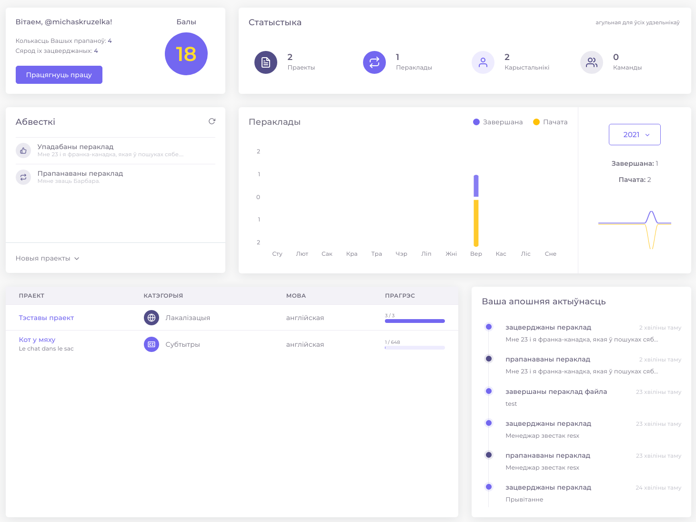
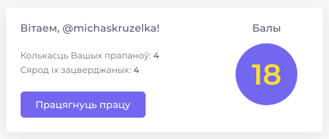
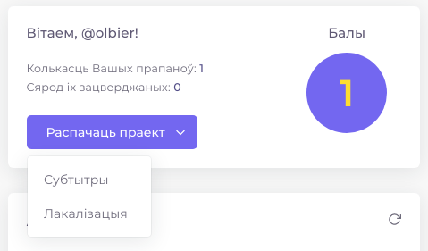
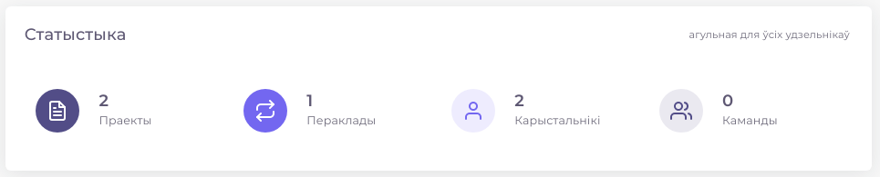
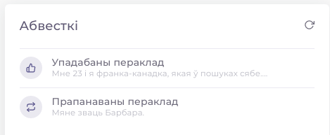
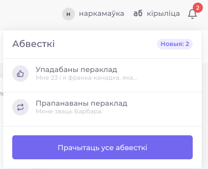
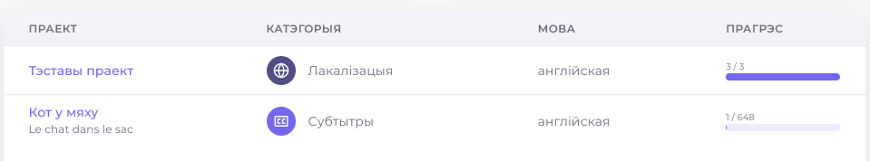

# Галоўная старонка

На галоўнай старонцы прадстаўлена агульная статыстыка, колькасць Вашых балаў і прапаноў, спіс новых праектах, абвесткі і апошняя актыўнасць.

У гэтым блоку адлюстроўваецца колькасць балаў і прапаноў па перакладзе. 


Балы падлічваюцца наступным чынам: за кожную прапанову даецца 1 бал, плюс дадатковыя 2 балы за кожную падабайку прапановы \(акрамя той, якая была пастаўлена аўтарам прапановы\), плюс дадатковыя 3 балы за кожную зацверджаную прапанову. 


Унізе паказваецца кнопка са спасылкай на апошні створаны Вамі праект з загружаным файлам. Калі такога праекта няма, кнопка прывядзе на старонку стварэння яго.

Гэты блок паказвае статыстыку, агульную для ўсіх удзільнікаў: колькасць створаных праектаў з загружанымі файламі, колькасць гатовых перакладаў, колькасць зарэгістраваных карыстальнікаў і колькасць створаных каманд.

Гэты блок паказвае спіс абвестак. Гэты спіс сінхранізаваны з тым, які паказваецца ў верхняй панэлі. 

Спіс абнаўляецца кожные дзве хвіліны. Калі трэба абнавіць спіс неадкладна, то для гэта патрэбна націснуць на іконку ў верхнім правым вуглу.

У гэтым блоку паказваецца спіс новых праектаў: назва, катэгорыя, мова, з якой здзяйсняецца пераклад і прагрэс \(колькі перакладзена кавалкаў тэксту ў файле і колькі кавалкаў усяго ў файле\).

