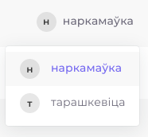
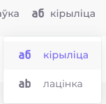
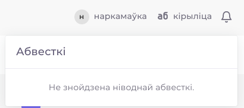
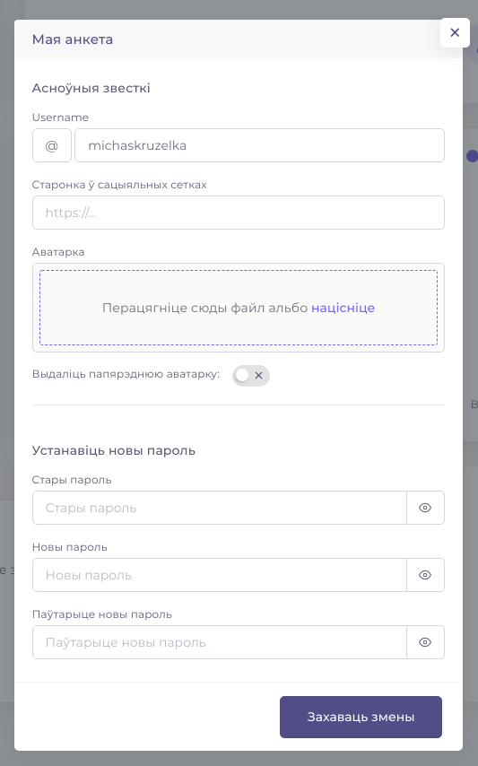
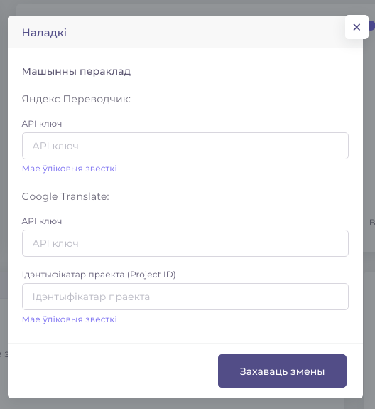

# Верхняя панэль

У верхняй панэлі можна выбраць правапіс і алфавіт інтэрфейса, прагледзець абвесткі, змяніць інфармацыю ў сваёй анкеце, пазначыць свае ўліковыя звесткі для сэрвісаў машыннага перакладу, а таксама выйсці з "Перакладай".

Інтэрфейс сэрвісу "Перакладай" даступны ў двух правапісах — акадэмічным \("наркамаўка"\) і класічным \("тарашкевіца"\).

Таксама можна выбаць зручны для Вас алфавіт — кірыліцу альбо лацінку. 

Тут змяшчаецца спіс абвестак, на якія Вам варта звярнуць увагу. Гэта можа быць новая прапанова па перакладзе ад іншага карыстальніка, новы каментар, запрашэнне ў праект альбо каманду, або падабайка, пастаўленая пад Вашай прапановай. Новая абвестка з'явіцца цягам двух наступных хвілін пасля падзеі.

У наладках можна пазначыць свае ўліковыя звесткі для перакладных сэрвісаў, каб карыстацца машынным перакладам. На дадзены момант машынны пераклад можна рабіць праз Google Translate і Яндекс Переводчик.

